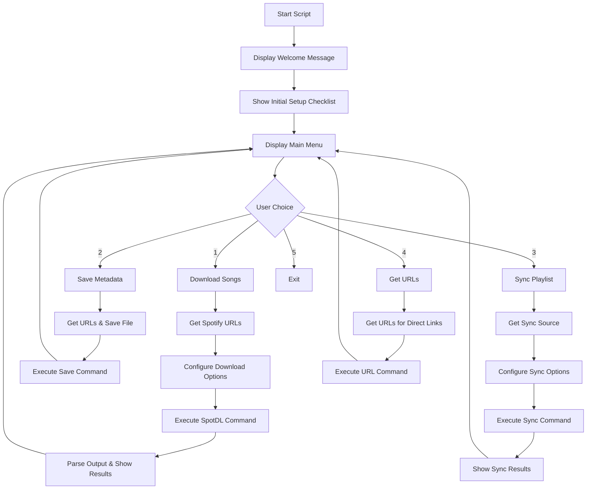

# 🎵 SpotDL User-Friendly Downloader Script

[](https://www.python.org/)
[](https://github.com/spotDL/spotify-downloader)
[](#disclaimer)
[]()

A comprehensive, user-friendly Python wrapper script for **SpotDL v4** that simplifies downloading music from Spotify with an interactive menu system and advanced error handling.

## 📋 Table of Contents

- [Features](#-features)
- [Prerequisites](#-prerequisites)
- [Installation Guide](#-installation-guide)
- [Quick Start](#-quick-start)
- [Main Menu Options](#-main-menu-options)
- [Script Workflow](#-script-workflow)
- [Advanced Usage](#-advanced-usage)
- [Troubleshooting](#-troubleshooting)
- [SpotDL Documentation](#-spotdl-documentation)
- [Disclaimer](#-disclaimer)

## ✨ Features

- **🎯 Interactive Menu System**: Easy-to-use command-line interface
- **📁 Smart Directory Management**: Automatic output directory creation and validation
- **🎵 Multiple Audio Formats**: Support for MP3, M4A, FLAC, OPUS, WAV, AAC
- **⚡ Concurrent Downloads**: Configurable multi-threaded downloading
- **📝 Metadata Embedding**: Automatic lyrics, album art, and track information
- **🔄 Playlist Synchronization**: Keep local playlists in sync with Spotify
- **❌ Error Handling**: Comprehensive error detection and reporting
- **📊 Download Summaries**: Detailed reports of successful and failed downloads
- **🎛️ Advanced Options**: Support for custom FFmpeg and yt-dlp arguments

## 🔧 Prerequisites

Before using this script, ensure you have:

1. **Python 3.7 or higher** installed on your system
2. **Git** (optional, for cloning repositories)
3. **Internet connection** for downloading dependencies and music
4. **Spotify account** (free or premium) for accessing track metadata

## 📦 Installation Guide

### Step 1: Create a Virtual Environment

**For Windows:**
```cmd
# Navigate to your desired directory
cd "C:\Users\YourUsername\Music\SpotDL"

# Create virtual environment
python -m venv spotdl_env

# Activate virtual environment
spotdl_env\Scripts\activate
```

**For macOS/Linux:**
```bash
# Navigate to your desired directory
cd ~/Music/SpotDL

# Create virtual environment
python3 -m venv spotdl_env

# Activate virtual environment
source spotdl_env/bin/activate
```

### Step 2: Install SpotDL

```bash
# Ensure your virtual environment is activated (you should see (spotdl_env) in your prompt)
pip install --upgrade pip
pip install spotdl
```

### Step 3: Install FFmpeg

SpotDL requires FFmpeg for audio processing. You have two options:

**Option A: Let SpotDL install FFmpeg (Recommended)**
```bash
spotdl --download-ffmpeg
```

**Option B: Install FFmpeg system-wide**
- **Windows**: Download from [FFmpeg official site](https://ffmpeg.org/download.html) or use `winget install FFmpeg`
- **macOS**: Use Homebrew: `brew install ffmpeg`
- **Linux**: Use package manager: `sudo apt install ffmpeg` (Ubuntu/Debian) or `sudo yum install ffmpeg` (CentOS/RHEL)

### Step 4: Download the Script

Save the `spotdl_downloader.py` file to your SpotDL directory, or copy the script content into a new file.

### Step 5: Verify Installation

```bash
# Test SpotDL installation
spotdl --version

# Test FFmpeg installation
ffmpeg -version
```

## 🚀 Quick Start

1. **Activate your virtual environment:**
   ```bash
   # Windows
   spotdl_env\Scripts\activate
   
   # macOS/Linux
   source spotdl_env/bin/activate
   ```

2. **Run the script:**
   ```bash
   python spotdl_downloader.py
   ```

3. **Follow the interactive menu** to download your favorite music!

## 🎛️ Main Menu Options

### Main Menu Interface
```
--- spotDL v4 User-Friendly Downloader Script ---
1. Download Songs (from Spotify URLs)
2. Save Metadata (generate .spotdl files for tracks/playlists)
3. Sync Playlist/Album (download new, remove deleted from local)
4. Get Direct Download URLs (view source URLs without downloading audio)
5. Exit
```

### 1. Download Songs
- **Purpose**: Download individual tracks, albums, playlists, or artist discographies
- **Input**: Spotify URLs (space or newline separated)
- **Features**:
  - Choose output directory
  - Select audio format (MP3, M4A, FLAC, etc.)
  - Configure bitrate (0 for highest quality, 320k, 256k, etc.)
  - Enable/disable lyrics and metadata embedding
  - Set concurrent download threads
  - Handle existing files (skip, force overwrite, update metadata)

### 2. Save Metadata
- **Purpose**: Generate `.spotdl` files containing track metadata without downloading audio
- **Use Case**: Create playlists for future batch downloads or sharing
- **Output**: `.spotdl` files that can be used with sync functionality

### 3. Sync Playlist/Album
- **Purpose**: Keep local music collection synchronized with Spotify playlists
- **Features**:
  - Download new tracks added to playlist
  - Remove local files for tracks removed from playlist
  - Use existing `.spotdl` files for faster synchronization
  - Maintain playlist organization

### 4. Get Direct Download URLs
- **Purpose**: Retrieve direct download links without downloading audio files
- **Use Case**: Integration with external download managers or automation scripts

## 🔄 Script Workflow



## 🛠️ Advanced Usage

### Custom Output Directory Structure
```bash
# Example directory structure the script can create:
Music/
├── Downloads/
│   ├── Playlists/
│   │   └── My Playlist/
│   ├── Albums/
│   │   └── Artist - Album Name/
│   └── Singles/
└── Metadata/
    └── playlist_backup.spotdl
```

### Advanced Command Arguments
The script supports passing custom arguments to SpotDL:

- **FFmpeg Arguments**: `--ffmpeg-args "-vn -loglevel quiet"`
- **yt-dlp Arguments**: `--yt-dlp-args "--no-check-certificate"`
- **Custom Search Queries**: Override Spotify matching with manual search terms

### Batch Processing
For large playlists or multiple operations:

1. Use the **Save Metadata** option first to create `.spotdl` files
2. Use **Sync Playlist** with the saved files for faster processing
3. Enable archive files to avoid re-downloading existing tracks

## 🔍 Troubleshooting

### Common Issues and Solutions

**❌ "spotdl command not found"**
- Ensure your virtual environment is activated
- Verify SpotDL installation: `pip list | grep spotdl`
- Reinstall SpotDL: `pip install --upgrade spotdl`

**❌ "FFmpeg not found"**
- Run `spotdl --download-ffmpeg` in your activated environment
- Or install FFmpeg system-wide (see installation guide)

**❌ "Could not find a match for song"**
- Try using custom search queries
- Check if the track is available in your region
- Verify the Spotify URL is correct and accessible

**❌ "AudioProviderError"**
- Usually indicates YouTube source issues
- Try downloading individual tracks instead of large batches
- Check your internet connection

**❌ Permission errors on Windows**
- Run command prompt as Administrator
- Check if antivirus is blocking the downloads
- Ensure the output directory is writable

### Getting Help

1. **Check SpotDL logs** for detailed error information
2. **Review the output** displayed by the script
3. **Visit the issues section** of the SpotDL GitHub repository
4. **Update SpotDL** to the latest version: `pip install --upgrade spotdl`

## 📚 SpotDL Documentation

For more detailed information about SpotDL v4:

- **📖 Official Documentation**: [SpotDL v4 Docs](https://spotdl.readthedocs.io/)
- **🐙 GitHub Repository**: [SpotDL/spotify-downloader](https://github.com/spotDL/spotify-downloader)
- **🆕 Release Notes**: [Latest Releases](https://github.com/spotDL/spotify-downloader/releases)
- **❓ Community Support**: [GitHub Discussions](https://github.com/spotDL/spotify-downloader/discussions)

### Additional Resources

- **Configuration Files**: Learn about `.spotdl.yml` configuration
- **CLI Reference**: Complete command-line interface documentation
- **API Usage**: Programmatic usage of SpotDL
- **Plugin Development**: Extending SpotDL functionality

## ⚖️ Disclaimer

### Important Legal Notice

**This script and SpotDL are intended for educational and personal use only.** Please be aware of the following:

- 🔒 **Respect Copyright Laws**: Only download music you have the legal right to download
- 📜 **Terms of Service**: Ensure compliance with Spotify's Terms of Service
- 🌍 **Regional Restrictions**: Respect geographical content restrictions
- 🏠 **Personal Use**: Downloads should be for personal, non-commercial use only
- 💰 **Support Artists**: Consider purchasing music or streaming subscriptions to support artists

### Liability

- The authors of this script are not responsible for any misuse or legal issues arising from its use
- Users are solely responsible for ensuring their usage complies with applicable laws and regulations
- This tool is provided "as-is" without any warranties or guarantees

### Best Practices

1. **🎵 Use Premium Accounts**: Support the music industry with legitimate subscriptions
2. **📝 Keep Records**: Maintain documentation of your legal music library
3. **🔄 Regular Updates**: Keep SpotDL updated for the best experience and security
4. **🛡️ Backup Important Data**: Always backup your music library and metadata files

---

**Made with ❤️ for music lovers who want a better download experience.**

*For issues, suggestions, or contributions, please refer to the SpotDL GitHub repository.*
